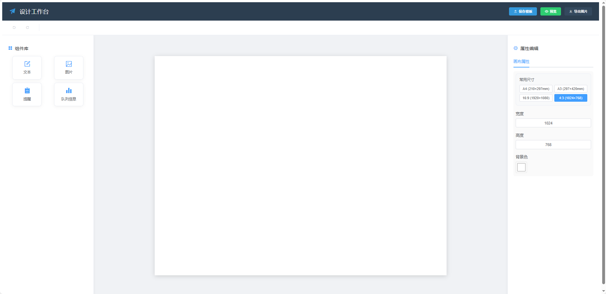

# 设计工作台

一个低代码拖拽组件，用于创建、编辑和导出各类设计稿。




## 技术栈

- **前端框架**：Vue.js 2.x
- **UI组件库**：Element UI
- **状态管理**：Vuex
- **路由管理**：Vue Router
- **图片导出**：html2canvas
- **组件拖拽**：vue-draggable-resizable
- **数据传递**：vue-portal

## 核心功能

### 1. 可视化编辑器

- 基于画布的编辑模式
- 组件拖拽放置与精确定位
- 多组件选择与对齐功能
- 撤销/重做操作历史
- 右键菜单上下文操作

### 2. 组件系统

- 文本组件：支持富文本编辑与样式调整
- 图片组件：支持图片上传与缩放
- 号码组件：用于展示队列号码
- 队列信息组件：用于展示队列详情

### 3. 模板管理

- 模板保存与加载
- 本地存储支持
- 导出为高质量图片

### 4. 预览功能

- 独立预览窗口
- 实时查看设计效果
- 导出预览图片

## 项目结构

```
vue-restored/
├── public/               # 静态资源
│   ├── index.html       # HTML入口文件
│   └── static/          # 静态JS文件
├── src/                  # 源代码
│   ├── assets/          # 资源文件
│   ├── components/      # 通用组件
│   │   └── widgets/     # 设计组件
│   ├── router/          # 路由配置
│   ├── store/           # Vuex状态管理
│   ├── views/           # 页面视图
│   │   ├── Edit.vue     # 编辑页面
│   │   └── Screen.vue   # 预览页面
│   ├── App.vue          # 根组件
│   └── main.js          # 入口文件
└── package.json         # 项目依赖
```

## 功能页面

- `/edit`：设计工作台主界面
- `/screen`：预览显示页面
- `/window`：窗口显示页面
- `/ad`：广告显示页面

## 技术实现细节

### 编辑器核心

编辑器通过自定义组件系统实现，每个组件均支持以下功能：

1. **拖拽与调整大小**：使用vue-draggable-resizable实现组件的位置和大小调整
2. **状态管理**：每个组件维护自己的状态，支持实时保存和恢复
3. **历史记录**：实现了完整的编辑历史系统，支持多级撤销和重做
4. **组件选择**：支持单选和多选，实现组件的批量操作

### 画布系统

1. **坐标系统**：基于绝对定位的坐标系统，保证组件的精确放置
2. **缩放控制**：支持画布尺寸的灵活调整
3. **背景样式**：支持自定义背景颜色和透明度

### 图片导出

使用html2canvas库实现高质量图片导出：

1. **无损转换**：将画布内容无损转换为图片
2. **高分辨率**：支持2倍分辨率导出，确保图片清晰度
3. **透明度支持**：保留原始设计中的透明效果

## 安装与使用

```bash
# 安装依赖
npm install

# 开发模式运行
npm run serve

# 构建生产版本
npm run build
```

## 浏览器兼容性

- Chrome 60+
- Firefox 54+
- Safari 11+
- Edge 79+

## 许可证

MIT 